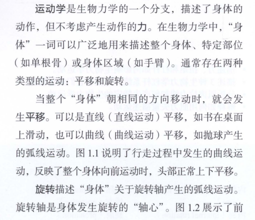
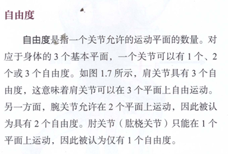
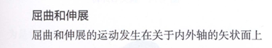
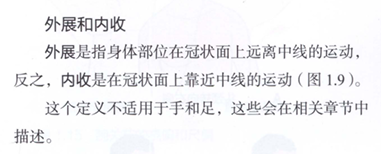
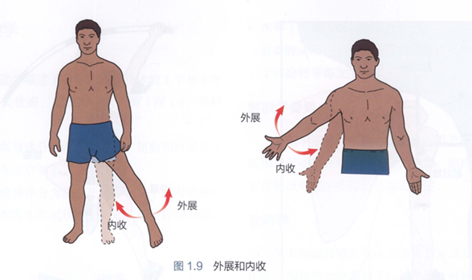
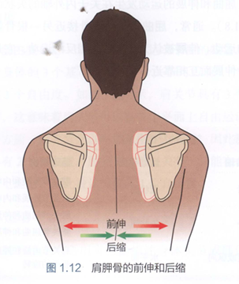

# 基础肌动学笔记
## 前言
先学完这本书再掌握三大类相应的技术：肌肉、骨骼、神经手法；

前三章是基础，其他部分是解释；

## 第一章
广义运动：

天动地动，人活着就是在运动

坐着也是运动，因为坐着是肌肉保持一个姿势；

运动是改变物体状态的唯一因素；

狭义运动：

身体大概组成：神经控制肌肉，肌肉控制骨骼，骨骼反向影响神经

两种基本类型运动：平移和旋转

平移：直线、滑动

旋转：只要旋转，必定存在一个旋转轴！绕着旋转轴旋转

**质心和重心**

人体活动时的比较重要的一个点位，比如球的质心就是球心

所有运动都是肌肉围着某一个旋转轴发生运动

前面肌肉拉的或者后面肌肉拽的

主动运动和被动运动：自己产生的，如果主动运动会有问题，那么神经和骨骼都有问题

被动运动有问题，肌肉和骨骼都有问题

**案例**

内侧，就是在里面，内脏和呼吸有问题，情绪化多
外侧，能够指出问题，容易解决。

**运动平面**

矢状面 冠状面 水平面

矢状面运动：屈伸，向前是屈，向后是伸，

矢状面绝对运动：只在矢状面发生，不发生冠状面和水平面的运动！

前驱的定义是绝对在矢状面平面上做的一个动作，有一个标准体位，不偏内也不偏外。

**临床案例**

1.标准动作：矢状面抬手臂，如果抬手臂朝外偏转，说明神经对外侧肌肉过度支配，外部肌肉过度收缩

2.比如腰椎很适合弯腰，但是发生偏离旋转就会出现运动损伤。

**旋转轴**

旋转轴始终垂直于运动平面

**案例**

老式自行车轮胎歪了，转动给与车轴一个力，每次都做了一个不需要的动作导致车轴损坏。

人体核心：躯干：颅腔胸腔腹腔

**临床案例**

人体是一个整体，头向下腰向下都叫屈，比如想看下面，颈前屈屈不下去会屈腰，治疗的时候反过来如果颈前屈屈不下去，可以让在矢状面上做绝对运动，屈腰伸腰，可以治疗颈部的屈伸受限。

靠近中间就是向内，远离中间是向外。扇巴掌就是水平内旋。

**临床案例**

腰和颈的侧屈，它们的区别是部位不同，共同点是都是在冠状面上运动，腰部压痛时，按住颈部做侧屈，压痛感消失。

自由度

 

所有关节都可以在3个平面上运动，只不过有一些只能被动运动。常见意义上自由度就是主动运动涉及的平面。

屈伸

在矢状面上向前的运动都是屈，向后的是伸，**有屈才有伸**，屈伸本质上是一回事。

外展内收

**临床案例**

小鸡拍翅膀，过度向外，肩膀斜方肌变高，内外失衡

旋转

靠近内侧叫内旋，靠近外侧叫外旋

环转

前伸与后缩

远离中线和向中线

水平内收和外展：肩关节在水平面上的运动
